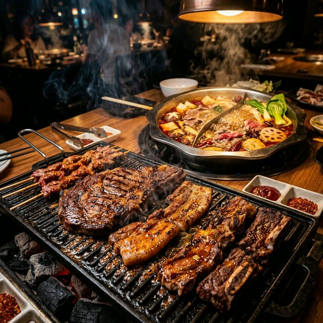
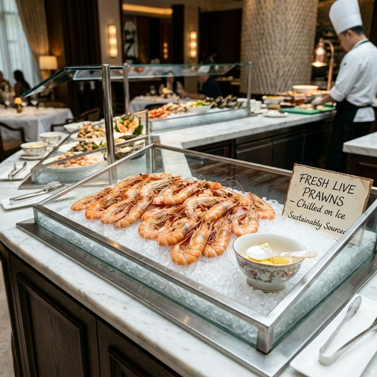
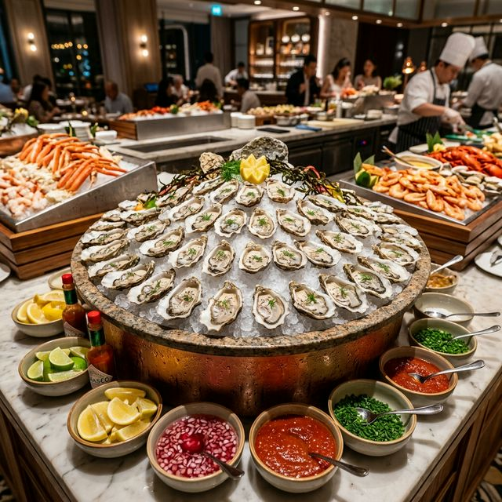
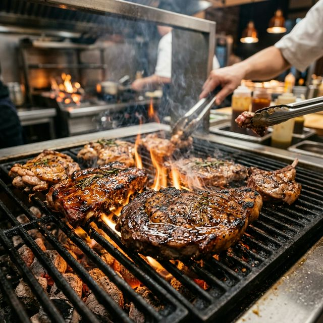
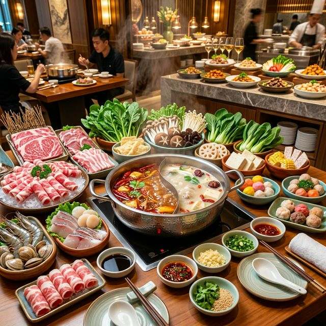

# HAHA Buffet Steamboat BBQ Kepong

---

## 🍲 Malaysia's Best Rated Buffet (Kepong)

**Experience the ultimate RM60-80 Steamboat & BBQ Buffet in Kepong.**

- ⭐ **4.8 stars** (3,839 reviews)
- 🦐 Unlimited live prawns
- 🦪 Fresh oysters
- 🥩 Sizzling BBQ meats
- 🍲 Hotpot selection
- 🍫 Chocolate fountain
- 🍦 Ice cream bar
- 🕔 **Open daily: 5:00 PM – 6:00 AM**

---

## 📸 Menu Highlights

|  |  |  |  |
|:---:|:---:|:---:|:---:|
| Live Prawns | Fresh Oysters | BBQ Meats | Hotpot |

---

## 💸 Pricing

- **Adult:** RM 60 - 80
- **Includes:** Unlimited seafood, live prawn refills, 100+ ingredients, dessert & drinks

---

## ⭐ Customer Reviews

> “High quality food! The variety is just insane.”  
> “Live prawns + big selection! Best BBQ in Kepong.”  
> “Worth the price! RM80 for all this is a steal.”

---

## 📍 Location

**HAHA Buffet Steamboat BBQ, Kepong**  
🕔 Daily: 5:00 PM - 6:00 AM

---

## 🔗 Socials

- TikTok
- Instagram
- Facebook

---

## 🛠️ Tech Stack

- HTML, CSS, JavaScript

---

## 🧑‍💻 Contributing

Pull requests are welcome! For major changes, please open an issue first to discuss what you would like to change.

---

## 📄 License

[MIT](LICENSE)
